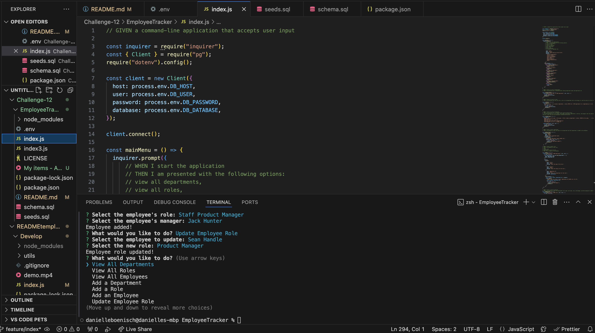

# EmployeeTracker
Repo Link: https://github.com/danielleboe/EmployeeTracker

## Description
A command-line application to manage a company's employee database, using Node.js, and Inquirer

Employee tracker to view and manage the departments, roles, and employees in my company

### User Story
- AS A business owner
- I WANT to be able to view and manage the departments, roles, and employees in my company
- SO THAT I can organize and plan my business

### Acceptance Criteria

- GIVEN a command-line application that accepts user input
- WHEN I start the application
- THEN I am presented with the following options: view all departments, view all roles, view all employees, add a department, add a role, add an employee, and update an employee role
- WHEN I choose to view all departments
- THEN I am presented with a formatted table showing department names and department ids
- WHEN I choose to view all roles
- THEN I am presented with the job title, role id, the department that role belongs to, and the salary for that role
- WHEN I choose to view all employees
- THEN I am presented with a formatted table showing employee data, including employee ids, first names, last names, job titles, departments, salaries, and managers that the employees report to
- WHEN I choose to add a department
- THEN I am prompted to enter the name of the department and that department is added to the database
- WHEN I choose to add a role
- THEN I am prompted to enter the name, salary, and department for the role and that role is added to the database
- WHEN I choose to add an employee
- THEN I am prompted to enter the employee’s first name, last name, role, and manager, and that employee is added to the database
- WHEN I choose to update an employee role
- THEN I am prompted to select an employee to update and their new role and this information is updated in the database

## Usage
1. Clone the Repo to a local environment.
2. Install Inquirer npm install express fs path
3. Install Postgress
4. Create .env file
3. Run node index.js in the directory in Terminal

## Video Walkthrough

### Built With

Node
Postgres

<!-- LICENSE -->
## License

Distributed under the MIT License. See `LICENSE.txt` for more information.

<!-- CONTACT -->
## Contact
Danielle Boenisch 
Email: danielleboenisch@gmail.com
Repo: https://github.com/danielleboe

Project Link: [https://github.com/danielleboe/EmployeeTracker](https://github.com/danielleboe/EmployeeTracker)